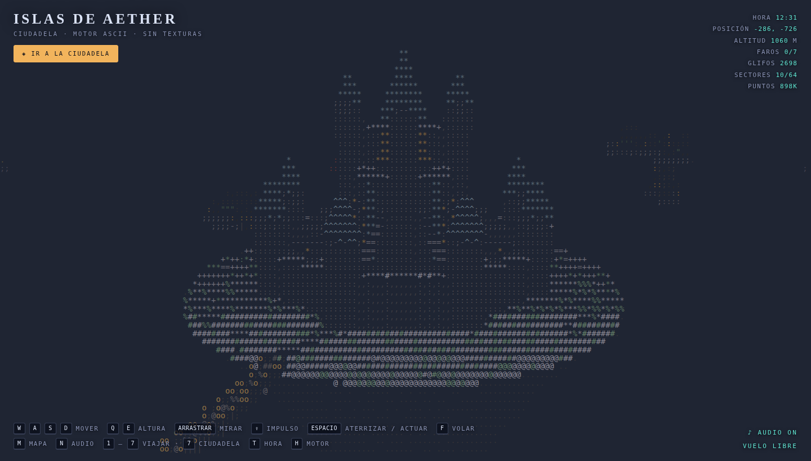

# Islas de Aether

Un mundo de fantasía **sin borde**, renderizado enteramente con caracteres. Sin texturas, sin mallas 3D, sin WebGL: un `<canvas>` 2D dibujando glifos sobre una rejilla, en **un solo archivo HTML** sin dependencias.

**→ [Entrar al mundo](https://fleremiasflemin20-maker.github.io/islas-de-aether/)**



---

## Qué hay dentro

- **Mundo infinito**: el espacio se divide en sectores que se generan cuando te acercas. No hay mapa fijo ni bordes.
- **Siete regiones con nombre** — Aether, Cenizas, Coral, Escarcha, Dunas, Abismo y la Ciudadela — más los Confines entre medias.
- **Caminos entre todas las islas**: cada una tiende un puente a su vecina más cercana, con tablero, barandas y faroles. Se cruzan a pie.
- **La Ciudadela**: una isla cuatro veces mayor que cualquier otra con una fortaleza encima — muralla octogonal, ocho torres, casa de puertas, patio y un torreón escalonado con agujas.
- **Luz en tiempo real**: cada punto guarda su normal; el sombreado se calcula contra el sol o la luna en cada fotograma, con oclusión ambiental precalculada.
- **Ciclo día/noche** con sol y luna físicos, ventanas y cristales que se encienden al anochecer.
- **Dragones que reaccionan a tu mirada** y rugen cuando te ven.
- **Puedes aterrizar y caminar** por las islas, y encender los seis faros.
- **Audio procedural** (viento, cascadas, rugidos) generado con WebAudio, sin un solo archivo de sonido.
- **Táctil en móvil**: joystick, mirada por arrastre y botones.
- Todo el mundo y el render viven **en un Web Worker**, así que generar sectores nuevos no da tirones.

## Controles

| Tecla | Acción |
|---|---|
| `W` `A` `S` `D` | Mover |
| `Q` `E` | Bajar / subir |
| arrastrar | Mirar |
| `⇧` | Impulso |
| `espacio` | Aterrizar · saltar · encender faro |
| `F` | Volver a volar |
| `M` | Mapa |
| `1`–`7` | Viajar a una región (`7` = la Ciudadela, o el botón de arriba a la izquierda) |
| `T` | Adelantar la hora |
| `N` | Audio |
| `H` | Cómo funciona el motor |

En móvil: joystick a la izquierda, mirada a la derecha, botones abajo a la derecha.

Añade `?semilla=loquesea` a la URL y tendrás otro mundo entero.

## Cómo funciona el motor

1. **Nube de puntos, no polígonos.** Cada punto lleva posición, normal (3 bytes), material y oclusión. Islas, quillas colgando, troncos, copas, agujas, casas huecas y puentes con catenaria salen de ruido con semilla.

2. **Proyección en perspectiva.** Se rota a espacio de cámara (`yaw`, `pitch`) y se divide entre la profundidad: `x/z`, `y/z`. Hay que corregir que la celda de texto es más alta que ancha, o todo sale estirado.

3. **Z-buffer por celda.** Una rejilla paralela guarda la profundidad más cercana de cada celda de caracteres. Lo que llega más lejos se descarta: oclusión real sin ordenar nada.

4. **La rampa de caracteres es el sombreado.** El brillo indexa la rampa del material: `. , : ; - = + * # @`. Cada material tiene rampa y color propios, por eso roca, musgo y cristal se leen distinto siendo todo texto.

5. **Luz de verdad, no horneada.** El sombreado se calcula cada fotograma como `dot(normal, dirección del sol)` — o de la luna de noche — más el rebote del cielo por arriba. Las laderas se encienden y se apagan según la hora. Encima va una oclusión ambiental precalculada con una rejilla de ocupación: los huecos y las grietas se oscurecen solos.

6. **Caminos que se pueden pisar.** Cada isla busca a su vecina más cercana entre los nueve sectores de alrededor y le tiende un puente. Como las dos hacen la misma cuenta sobre los mismos datos, el par se dibuja una sola vez —lo pone quien tiene la clave menor— y los extremos coinciden aunque cada sector se genere en un momento distinto. Andando, la baranda empuja hacia el centro del tablero: sin eso, un camino de 4,4 unidades de ancho se cruza una vez de cada cinco.

7. **Sectores, culling y LOD.** El mundo se divide en celdas de 180 unidades generadas bajo demanda desde `hash(sx, sz, semilla)`; las lejanas se desalojan. Cada fotograma se descartan de golpe las que caen fuera del cono de visión o más allá de la niebla, y las que quedan se recorren *salteadas* (1 de cada 2, 4 u 8 según distancia). Se tocan decenas de miles de puntos por fotograma, no medio millón.

8. **Todo eso en un Worker.** Generación y proyección corren fuera del hilo principal y devuelven la rejilla resuelta en buffers transferibles que van y vienen sin copiarse. El hilo principal solo pinta, suena y juega. Si el navegador bloquea los workers, el mismo código corre en línea y no se nota más que en el rendimiento.

9. **Pintado en tiras.** Cada fila agrupa celdas contiguas del mismo color en una cadena y se dibuja de un golpe: de ~10.000 celdas a unos cientos de llamadas a `fillText`.

## Añadir una región

Una región es solo datos. El motor no distingue Aether de Cenizas:

```js
{
  name: "Tu región", sub: "un subtítulo",
  cx: 0, cz: 0, cy: 0, span: 170, rMin: 8, rMax: 26,
  flora: "tree",        // "tree" | "dead" | "shroom"
  houses: true, spires: 2,
  glow: { 2: 0.8 },     // materiales que brillan de noche
  skyNight: [6, 8, 14], skyDay: [30, 50, 70],
  mats: [ /* 8 colores RGB: roca, follaje, cristal, luz, agua, dragón, libre, madera */ ]
}
```

Añádela al array `REGIONS` y ya existe ese sitio del mundo.

## Licencia

MIT.
